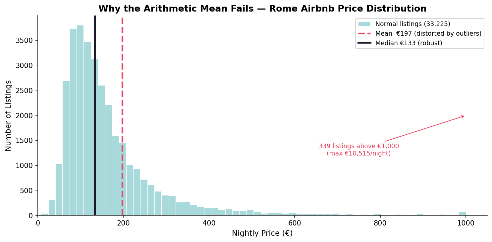
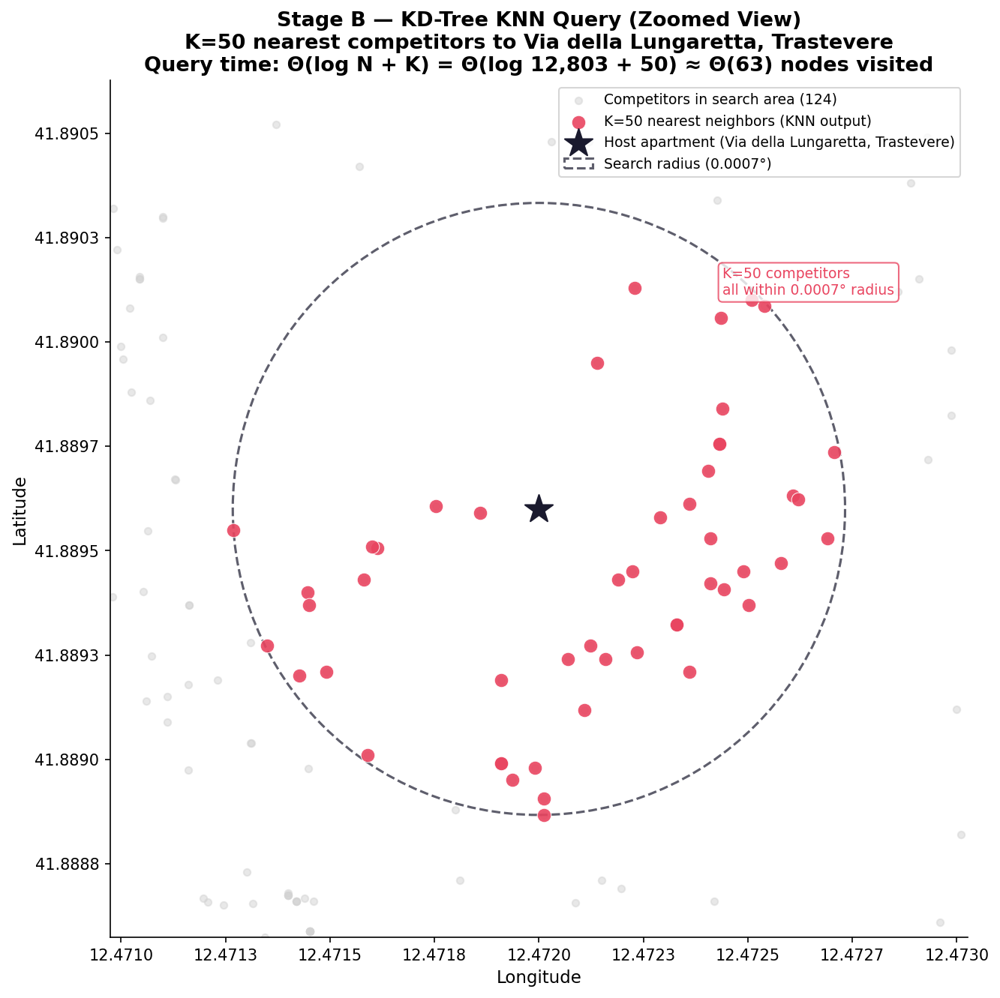

# Airbnb Market Radar — Price Estimator Rome

A 3-stage algorithmic pipeline that estimates the optimal nightly price for an Airbnb listing in Rome by finding the median price among the 50 nearest competitors of the same type.

**Course:** Algorithms of Data Science · University of Warsaw (Erasmus) · 2025/26
**Author:** Emanuele Bellezza

---

## The Problem

An Airbnb host needs to price their listing competitively. A simple city-wide average is meaningless — a penthouse in Trastevere doesn't compete with a shared room near Tiburtina. The system answers: *"What do the 50 most similar, geographically closest listings actually charge?"*

---

## Preview




*Full set of charts and the step-by-step walkthrough are in the notebook — see [How to Run](#how-to-run).*

---

## Pipeline Architecture

The system filters a large dataset through 3 cascading stages, progressively discarding irrelevant data.

```
Raw dataset (all Rome listings)
        │
        ▼
┌───────────────────────────────┐
│  Stage A — Hash Map Filter    │  O(1) lookup by category
│  room_type + neighbourhood    │  → ~hundreds of listings
└───────────────────────────────┘
        │
        ▼
┌───────────────────────────────┐
│  Stage B — KD-Tree + KNN      │  O(M log M) build · O(K log M) query
│  K = 50 nearest by lat/lon    │  → 50 competitor prices
└───────────────────────────────┘
        │
        ▼
┌───────────────────────────────┐
│  Stage C — QuickSelect        │  Θ(K) time · Θ(1) space
│  Median of 50 prices          │  → suggested price
└───────────────────────────────┘
```

### Stage A — Hash Map (Dictionary)
Indexes every listing by a composite key `"room_type_neighbourhood"`. Extracts only listings matching the host's category in **O(1)** average time. A Hash Map is chosen over a Balanced BST because we need pure retrieval speed, not sorted traversal.

### Stage B — KD-Tree & K-Nearest Neighbors
Builds a 2D spatial tree over the latitude/longitude of filtered listings in **O(M log M)**. Then queries the K=50 nearest neighbors in **O(K log M)** — orders of magnitude faster than a brute-force linear scan over all listings. The KD-Tree prunes entire geographic regions at each node.

### Stage C — QuickSelect (Hoare's Partitioning)
Finds the **median** of the 50 prices in **Θ(K)** expected time using in-place partitioning — no full sort required. QuickSort would waste **O(K log K)** sorting prices we'll never use (the extremes). QuickSelect stops as soon as it locates the middle element.

---

## Algorithm Complexity Summary

| Stage | Algorithm | Time | Space | Bottleneck |
|-------|-----------|------|-------|-----------|
| A | Hash Map lookup | O(1) avg | O(N) | — |
| B | KD-Tree build | O(M log M) | O(M) | ✅ Yes |
| B | KNN query | O(K log M) | O(K) | — |
| C | QuickSelect | Θ(K) avg | Θ(1) | — |

*N = all listings, M = listings after Stage A filter, K = 50*

---

## Dataset

**Source:** [Inside Airbnb — Rome](http://insideairbnb.com/get-the-data/)
Public dataset of Airbnb listings in Rome, Italy.

| File | Description | Size |
|------|-------------|------|
| `listings.csv` | Main dataset used by the pipeline | ~6 MB |
| `listings.detail.csv` | Extended metadata (not used) | ~83 MB |
| `calendar.detail.csv` | Availability calendar (not used) | ~485 MB |

> ⚠️ Only `listings.csv` and `neighbourhoods.csv` are tracked in this repo. The large files are excluded via `.gitignore`.

---

## How to Run

### 1. Clone & install dependencies
```bash
git clone https://github.com/Emanuele-bellezza/airbnb-price-estimator-rome.git
cd airbnb-price-estimator-rome
pip install -r requirements.txt
```

### 2. Open the notebook
```bash
jupyter notebook Emanuele_Bellezza_K-18722.ipynb
```
Run all cells. The final cell launches an interactive CLI that asks for:
- Room type (1–4)
- Neighbourhood (1–15)
- Latitude and longitude

### 3. Example interaction
```
Select your room type:
  [1] Entire home/apt
  [2] Private room
  ...

Enter number (1-4): 1

Select your neighbourhood:
  [ 1] I Centro Storico
  ...

→ Suggested price: €127 / night
   (median of 50 nearest competitors)
```

---

## Slides

A short presentation summarizing the project is available at [`Presentazione - Airbnb Market Radar.pptx`](./Presentazione%20-%20Airbnb%20Market%20Radar.pptx).

---

## Repository Structure

```
airbnb-price-estimator-rome/
├── Emanuele_Bellezza_K-18722.ipynb        ← main notebook
├── Presentazione - Airbnb Market Radar.pptx  ← project slides
├── Data/
│   ├── listings.csv                       ← primary dataset
│   └── neighbourhoods.csv                 ← neighbourhood boundaries
├── assets/                                ← preview charts shown in this README
│   ├── chart_01_price_distribution.png
│   └── chart_04_kdtree_knn.png
├── requirements.txt
├── .gitignore
└── README.md
```

> Note: charts generated by the notebook (`chart_01`–`chart_06`) are not tracked in the repo — they're regenerated by running the notebook. Only the two preview images above, kept in `assets/`, are committed for the README.

---

## Tech Stack

| Tool | Purpose |
|------|---------|
| Python 3.x | Core language |
| pandas | Data loading & filtering |
| numpy | Numerical operations |
| scipy.spatial.KDTree | Spatial tree construction & KNN query |
| Custom QuickSelect | In-place median finding (no external library) |

---

## Key Design Decisions

**Why Hash Map over BST for Stage A?**
We only need exact-match retrieval, not ordered iteration. Hash Map gives O(1) vs O(log N) for BST.

**Why KD-Tree over brute-force distance?**
With ~10,000 filtered listings, brute-force computes 10,000 distances per query. KD-Tree reduces this to O(K log M) by pruning irrelevant spatial partitions.

**Why QuickSelect over sorting?**
We need only the median (position K/2), not the full order. QuickSelect achieves Θ(K) by skipping the partitions that can't contain the median.

---

## License

Academic project — University of Warsaw, Erasmus exchange 2025/26.
Dataset © Inside Airbnb (public data, insideairbnb.com).
